# Modules covered in Machine learning fundamentals
* optimization 
* statastical ML 
* probablistic ML
* representation learning 
* deep learning and more 

## plan for the talk 
* basic linear algebra 
* vector calculus 
* probability theory 
* Loss functions in ML

### Linear algebra 
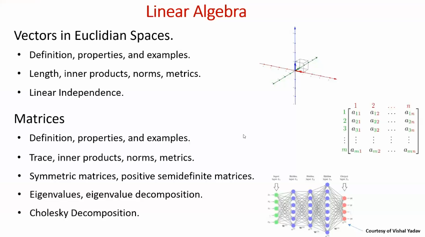

### Euclidian Space: 
> A space in any finite number of dimensions n, in which the points are designated by coordinates (one foreach dimensions) and the distance between two points is given by distance formula.  

### What's coordinates: 
> ordered collection of points from which we can identify the location with some reference points. 
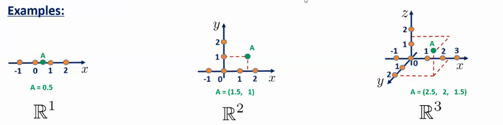

### Distance formula: 
> distances between the pairs of points in terms of coordinates. 
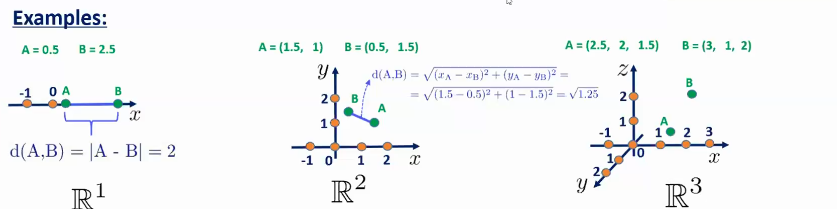

### Euclidian spaces: 
distance formula for n dimensional space ( square root of sum of the squares of all the components of the vector)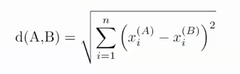

### valid distance metric: 
dist(A,B) > 0 
dist(A,A) = 0 
dist(A,B) = dist(B,A)
for any points A B and C dist(A,C) < dist(A,b) + dist(B,C)

eg. manhatten distance

## vectors in euclidian space: 
geometric object which has magnitude and direction. 
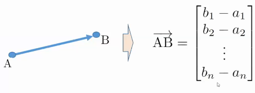

Magnitude: Length in between two points A and B. Typically the vectors start with the (0,0,..) So AB = B = [b1,b2,b3,...,bn]

### What can we do with the vectors: 
- Linear operations
    - Products
    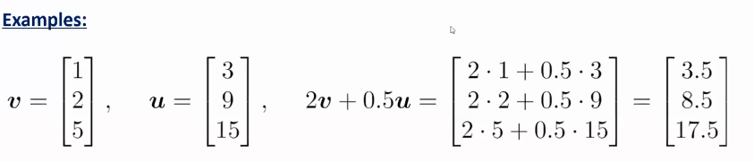
- inner product
    scalar which is the sum of the products of the corrosponding components ( the result is scalar)
    - symmetric
    - multiplication on zero 
    - orthogonality of the vectors ( the inner products will be 0) 
    - linearity: scalars can be multiplied inside without affecting the operations by other scalars

    ### Application in ML
    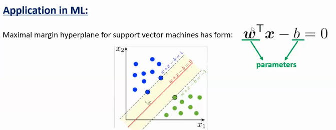

- component wise products 
multiplication sequentially 
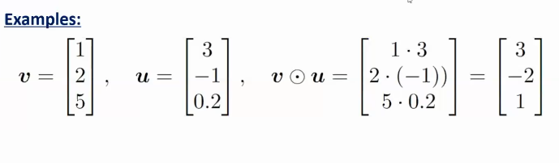

    ### application
    Adam update equation !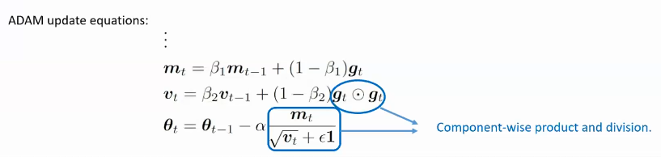

    we use the component wise product for calculating this.

- kronecker product 
multiplying components as scalar and multipying as full components in vector V
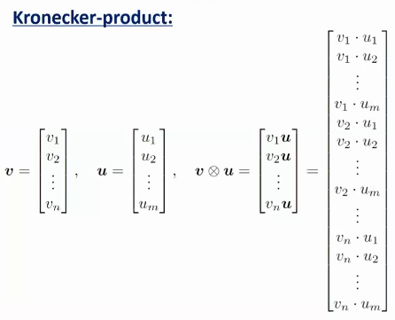 

### Vector norms: 
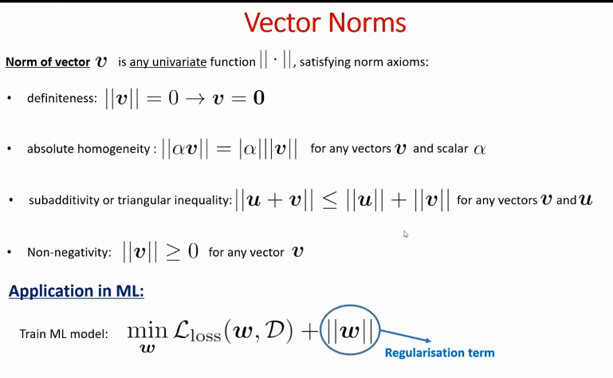
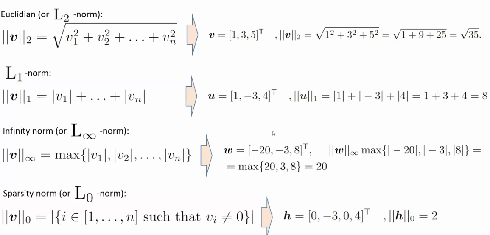
sparsity norm is not valid norm ( L0 norm ) 

### Linear independence: 
collection of the vectors is called linearly independent if 
multiplication of zero scalar to all the vectors sum results in 0 
and if it's zero then always the scalar is zero

## matrices
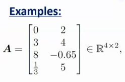

### matrix operations 
- transpose: converting the rows into columns of the matrix 
**symmetric** no of rows and columns are same and original matrix and transpose matrix are same
- linear operations : add sub multiply by scalar

## matrix operatinos application machine learning 
**feedforward network:** 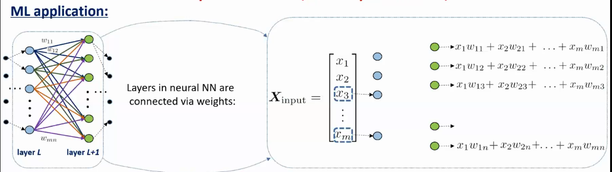
feed forward network is another matrix multiplication  